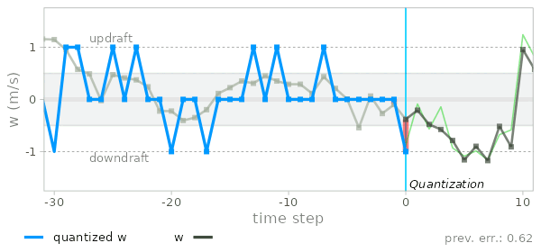
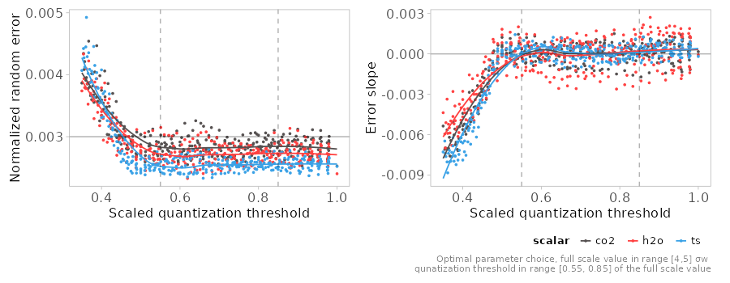

# Quantized eddy accumulation with error diffusion

*This repository contains code and data supplementary to the paper*

**100-fold improvement in relaxed eddy accumulation flux estimates through error diffusion**

[Anas Emad](https://orcid.org/0000-0002-0141-5262)
  
Currently under peer review. A preprint is available on arXiv: 
https://arxiv.org/abs/2312.17027


## Overview

<p align="center">
  
</p>

**Key idea**


The key idea is rethinking relaxed eddy accumulation (REA) as a process of
quantizing the vertical wind velocity. Inherent biases in fluxes quantified via
REA are attributed to the correlation between scalar concentration and
quantization error. To minimize these biases, an error diffusion algorithm is
developed. This algorithm randomizes the quantization error, thereby reducing
its correlation with the scalar - and consequently, the biases in the flux - to
near zero. The resulting method, termed **quantized eddy accumulation with error
diffusion**, maintains the minimal operational requirements of a constant sample
flow rate, similar to REA. However, unlike REA, it is a direct method (β factor
is not needed) and stands out as the first micrometeorological method that
allows an increase in the signal-to-noise ratio
without compromising accuracy.


## What purpose this repository serves

1. **Reproduce the results reported in my paper**
you can run the simulation described in the paper and produce the reported
figures and results.

2. **Run the simulation on your own high-frequency data**
If you are curious about the performance of quantize eddy accumulation on a
particular atmospheric constituent or site data, you can easily run the
simulation on your own high-frequency dataset.
Read further for more details.

3. **Provide reference functions for QEA implementation and flux calculation**
Under `src/implementation`, I have provided a [reference implementation](src/implementation/reference-implementation.R) for the error
diffusion algorithm and an example of [flux calculation](src/implementation/flux-calculation.rmd) with synthetic data.


## How to run

**Note**: running the analysis will download about 425 MB of raw [input data from zenodo](https://doi.org/10.5281/zenodo.10300363)

To run the simulations and reproduce the results, clone the repository to your
local machine, then type `make` similar to the following commands


```
git clone git@github.com:anasem/quantized-eddy-accumulation.git
cd quantized-eddy-accumulation
make
```

The resulting plots and results will be saved under the directory `output/`
under the root project folder

### Simulation parameters 

To change the simulation parameters or the data used, edit the file
`src/config.R` then run `make` again

To minimize the errors in fluxes calculated via QEA, it is recommended to use
a quantized level (full scale value) in the range [4,5] σw and a quantization
threshold in the range 0.55 to 0.85 of the full scale value

<p align="center">
  
</p>


## Running the simulation with your own data

To run the analysis on your own data, you need high-frequency measurements of
the scalar concentration and the 3D wind velocity. The data should be formatted
as one `data.table` with the following columns


| Variable Name | Description                 | Units                    |
|---------------|-----------------------------|--------------------------|
| time          | unique time stamp POSIXct   | seconds since unix epoch |
| CO2           | wet molar density           | $\mu mol\ m^{-3}$        |
| H2O           | wet molar density           | $mmol\ m^{-3}$           |
| Ts            | sonic temperature           | Kelvin                   |
| u, v, w       | 3D wind velocity components | $m\ s^{-1}$              |

Save the data as one RDS file in the `input` directory and edit the
`src/config.R` file to point to your data file.

These units will produce fluxes in the units $\mu mol m^{-2} s^{-1}$ for CO2 and
$mmol m^{-2} s^{-1}$ for water. You can choose other units if preferred.

## Software and Hardware requirements

The simulation takes about 1 hour to run on a modern Intel CPU with 12 cores and
32 GB of RAM.

## Setting up the environment

This analysis was only tested on Linux.

The following R packages need to be installed

```R
packages <- c("data.table", "ggplot2", "patchwork", "Rcpp", 
              "lubridate", "pracma", "hms", "scales", "psd", 
              "ggridges", "tools", "parallel")

```
A script to install these packages is provided in `src/install_dependencies.R`

Below is the output of `sessionInfo()` on my machine

<details>
   <summary>sessionInfo()</summary>

    ```R
    > sessionInfo()
    R version 4.3.2 (2023-10-31)
    Platform: x86_64-pc-linux-gnu (64-bit)
    Running under: Arch Linux

    Matrix products: default
    BLAS:   /usr/lib/libblas.so.3.12.0 
    LAPACK: /usr/lib/liblapack.so.3.12.0

    locale:
     [1] LC_CTYPE=en_US.UTF-8       LC_NUMERIC=C              
     [3] LC_TIME=de_DE.UTF-8        LC_COLLATE=en_US.UTF-8    
     [5] LC_MONETARY=de_DE.UTF-8    LC_MESSAGES=en_US.UTF-8   
     [7] LC_PAPER=de_DE.UTF-8       LC_NAME=C                 
     [9] LC_ADDRESS=C               LC_TELEPHONE=C            
    [11] LC_MEASUREMENT=de_DE.UTF-8 LC_IDENTIFICATION=C       

    time zone: Europe/Berlin
    tzcode source: system (glibc)

    attached base packages:
    [1] parallel  tools     stats     graphics  grDevices utils     datasets 
    [8] methods   base     

    other attached packages:
     [1] ggridges_0.5.4    psd_2.1.1         scales_1.2.1     
     [4] hms_1.1.3         pracma_2.4.2      lubridate_1.9.3  
     [7] Rcpp_1.0.11       patchwork_1.1.3   ggplot2_3.4.4    
    [10] data.table_1.14.8 nvimcom_0.9-159   colorout_1.3-0   

    loaded via a namespace (and not attached):
     [1] vctrs_0.6.4        cli_3.6.1          rlang_1.1.1       
     [4] generics_0.1.3     glue_1.6.2         colorspace_2.1-0  
     [7] fansi_1.0.5        grid_4.3.2         munsell_0.5.0     
    [10] tibble_3.2.1       lifecycle_1.0.3    compiler_4.3.2    
    [13] dplyr_1.1.4        RColorBrewer_1.1-3 timechange_0.2.0  
    [16] pkgconfig_2.0.3    R6_2.5.1           tidyselect_1.2.0  
    [19] utf8_1.2.3         pillar_1.9.0       magrittr_2.0.3    
    [22] withr_2.5.1        gtable_0.3.4      
    ```

</details>

